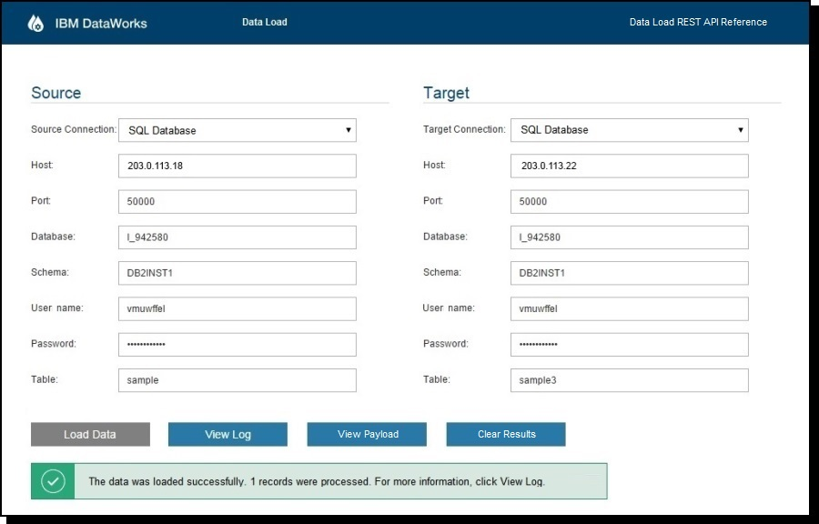

# Loading data with IBM DataWorks Data Load

This sample application demonstrates a way to use the IBM&#0174; DataWorks&#0153; Data Load REST API
to load data between multiple source and target types.

In the user interface for the application, users can enter source and target connection and
credential information and click **Load Data** to start the data loading process.
When the process completes, the results are shown. If the data loading process fails,
an error description is provided. Users can click **View Log** to access the log file. 
Click **View Payload** for instructions about how to view the payloads and to view links to API documentation.

For more information about IBM DataWorks for Bluemix and the IBM DataWorks Data Load REST API, see
[Getting Started with IBM DataWorks](https://www.ng.bluemix.net/docs/#services/dataworks1/index.html#dataworks).

## Structure of the application

The application contains these files in these directories:

* WebContent/

  This directory contains the client-side code files (HTML/CSS/JavaScript) of the application.
 
  To get started, you might want to review these files:

  - index.html: The HTML file for the sample application web page.

  - js/script.js: The JavaScript client, which calls the IBM DataWorks Data Load REST APIs implemented with JAX-RS.

* src/

  This directory contains the Java source files for the API that is called by the client code.
  Review these files to see how the IBM DataWorks Data Load REST API is used.
  The pertinent code can be found in the DataLoadResource.java file.
  

## Deploying the application

You can download the sample application code to your computer and deploy the application to Bluemix
by using command line tools. Or, you can use JazzHub to fork a copy of the sample application, and
then edit, build, and deploy it from your JazzHub user space.

**Option 1: Deploying the application from the command line**

Prerequisites:

  - [Git](https://hub.jazz.net/tutorials/clients/#installing_git), which you use to download the application.
  - [CloudFoundry CLI](https://www.ng.bluemix.net/docs/#cli/index.html#cli), which you use to push the 
  application to Bluemix.
  - [Apache Ant](http://ant.apache.org), which you use to rebuild the application if you modified the Java 
  source.

Procedure:

1. Clone this repository:

        git clone https://hub.jazz.net/git/dataworks/data-load

2. Change to the data-load directory.

3. If you have modified the sample application code, rebuild it:

        ant -f build.xml
        
    This step creates the data_load_sample.war file, which you use to deploy to Bluemix.
    If you haven't changed any code, you can skip this step.

4. Connect to Bluemix:

        cf api https://api.ng.bluemix.net

5. Log into Bluemix:

        cf login -u <YourUserName>

6. Deploy your application:

        cf push <YourAppName>
        
   This will create the application with the specified name, which is used to access it at
   https://<YourAppName>.mybluemix.net.
   The manifest.yml file contains default settings for the sample application that you can
   change before you push it to Bluemix, if desired.

**Option 2: Deploying the application from JazzHub**

See [the JazzHub documentation](https://hub.jazz.net/docs/build_deploy/) for full information,
but the steps are as follows:

1. [Open this project](https://hub.jazz.net/project/dataworks/data-load) in a new browser window.

2. Click **EDIT CODE**, and log in to JazzHub if you are not already authenticated.

3. Click **Fork**.

4. Provide a name for your copy of the sample and click **Save**.

5. When the project is copied into your repository, click **BUILD & DEPLOY**.

6. Click **Project Settings**.

7. Select **Deploy to Bluemix**, keep the other default values, and click **Save**.

8. On BUILD & DEPLOY, click **ADVANCED**, and click **add a builder**.

9. Keep the default values in the Add Builder page, and click **SAVE**.

10. Click **REQUEST BUILD**.

11. When the build has completed and you see a green check mark, click **add a stage**.

12. Provide a unique application name and click **SAVE**.

13. In the pipeline, drag the **Build** button to the deployment space to deploy the application to Bluemix. 
The number of times that the application has been built is displayed in the button.

## Binding an IBM DataWorks service to the sample application

If this is the first sample application you are deploying, add the IBM DataWorks service.
If you already created a Bluemix application that uses the IBM DataWorks service, bind an
existing service instance to that application instead of adding a new service.
This process might help prevent your Bluemix usage from reaching allocated limits.

* If this is the first time you are deploying an IBM DataWorks application:

    1. Go to Bluemix at https://bluemix.net and log in.

    2. Click **Catalog**.

    3. Browse through the available services. Under Data Management, click DataWorks.

    4. Select your sample application in the Add service section and click **Create**.

* If you previously deployed another IBM DataWorks application:

    1. Go to Bluemix at https://bluemix.net and log in.

    2. From the Bluemix dashboard, double-click your new application.

    3. Click **BIND A SERVICE**.

    4. Select an existing instance of the IBM DataWorks service to bind to the application.

## Viewing the sample application

To view the sample application user interface go to the URL specified as the route of your application.
For example: 

		https://<YourAppName>.mybluemix.net

In the application screen, enter your source and target connection information. 
Click **Load Data** to start the data load.
Click **View Log** to view the trace log of a completed data transaction.
Click **View Payload** for instructions on how to view the payloads and to view links to API documentation.
Click **Clear Results** to clear the results from a previous data transaction. The values that are entered about
the source and target are not cleared. These values can be reused.

## Related links

[Bluemix](https://ng.bluemix.net/)  
[Bluemix Documentation](https://www.ng.bluemix.net/docs/index.jsp)  
[Bluemix Developers Community](http://developer.ibm.com/bluemix)  

## Legal statement

The Data Load sample application for IBM DataWorks is a sample application which
demonstrates data load. The program is made available under the Apache license,
Version 2.0. The program interfaces with the IBM DataWorks service, which is made available
under separate IBM license. 

